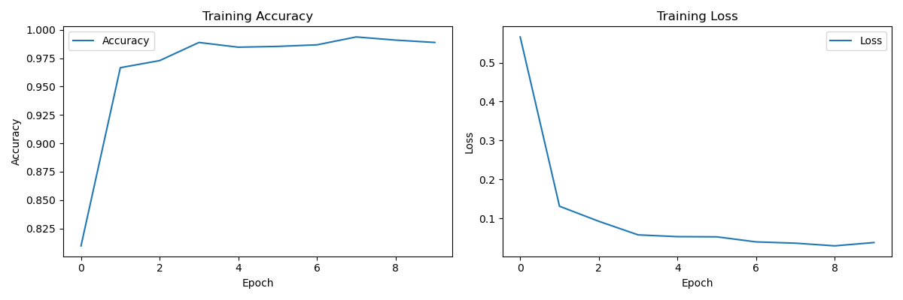
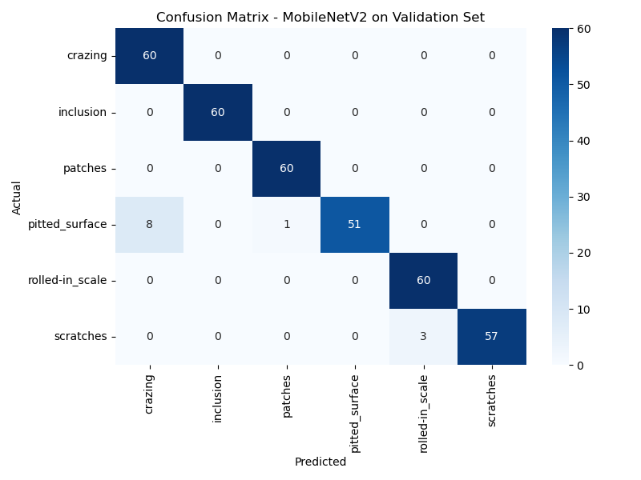

# Steel Surface Defect Detection System

An end-to-end **industrial computer vision inspection system** built around a **two-stage anomaly-first pipeline**:
Autoencoder-based anomaly detection → CNN-based defect classification → visual explainability → interactive Streamlit dashboard.

---

## 🔍 System Overview (High-Level)


**Pipeline Flow**  
Raw steel image → Anomaly Detection → Defect Classification → Explainability → Operator Dashboard

This system is designed to simulate a real-world industrial quality control workflow.

---

## 🧠 System Architecture

### Overall Pipeline Architecture


**Explanation**
- Autoencoder learns normal steel texture using defect-free samples only  
- Reconstruction error is used as an anomaly score  
- Only anomalous samples are forwarded to the classifier  
- CNN predicts defect category  
- Grad-CAM visualizes regions influencing the prediction  

---

### Module-Level Structure


**Explanation**
- Clear separation of anomaly detection, classification, explainability, and UI  
- Modular design for training, inference, and visualization  

---

## 📊 Model Training & Evaluation Results

### 1️⃣ CNN Training Behavior


Shows convergence behavior and training stability.

---

### 2️⃣ Defect Classification Performance


Demonstrates class-wise performance across industrial defect categories.

---

### 3️⃣ Anomaly Detection Behavior (Autoencoder)


Clear separation between normal and defective samples using reconstruction error.

---

### 4️⃣ Model Explainability (Grad-CAM)


Verifies that the CNN focuses on defect-relevant regions.

---

## 🖥️ Interactive Streamlit Dashboard

### 1️⃣ Dashboard Home & Image Upload


User uploads steel surface images for inspection.

---

### 2️⃣ Anomaly Detection Output


Displays anomaly score and normal/anomalous decision.

---

### 3️⃣ Defect Classification Result


Shows predicted defect class and confidence scores.

---

### 4️⃣ Explainability View (Grad-CAM)


Visual justification of CNN decision for operator trust.

---

### 📄 Complete Dashboard Walkthrough
See full walkthrough PDF:
docs/streamlit_dashboard_demo.pdf

---

## ⭐ Key Project Highlights

- Two-stage anomaly-first inspection pipeline  
- Autoencoder-based unsupervised anomaly detection  
- MobileNetV2 transfer learning for defect classification  
- Grad-CAM explainability integration  
- Interactive Streamlit dashboard  
- Modular, production-style project structure  

---

## 📁 Project Structure

```
steel-surface-defect-detector/
├── anomaly_detection/
├── defect_classification/
├── explainability/
├── streamlit_app/
├── data/
├── models/        # not tracked (large files)
├── results/
├── assets/
│   ├── banner/
│   ├── architecture/
│   └── dashboard/
├── docs/
├── README.md
└── LICENSE
```

---

## 🧠 Key Design Decisions

- Anomaly-first filtering to reduce false positives  
- Autoencoder chosen to avoid exhaustive defect labeling  
- Grad-CAM used for interpretability, not decision logic  
- UI separated from model logic  
- Model binaries excluded to keep repository lightweight  

---

## 🛠️ Technologies Used

TensorFlow · Keras · Autoencoders · CNNs · MobileNetV2 · Grad-CAM · OpenCV · Streamlit · NumPy · Matplotlib · Scikit-learn

---

## 👤 Author

**Akshat Jani**  
M.Sc. Mechatronics — University of Siegen  
Focus: Computer Vision · Industrial AI · Robotics
