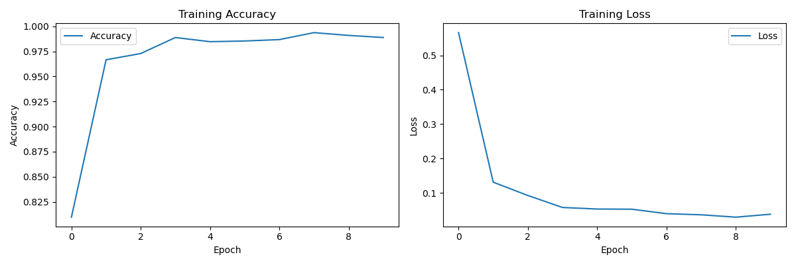
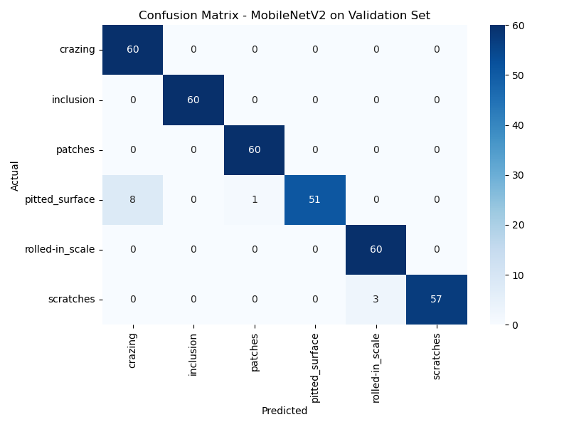

# Steel Surface Defect Detection System

An end-to-end computer vision system that detects defects in steel surfaces using Convolutional Neural Networks and transfer learning (MobileNetV2).  
Built for real-world industrial quality control, with a live prediction web app using Streamlit.

---

##  Sample Outputs

| Training Curves | Confusion Matrix | Real-world Prediction |
|-----------------|------------------|------------------------|
|  |  |  |

---

## Live App (Optional)

> 🔗 *[Add link here if deployed]*  
> Upload a steel surface image and get instant predictions with confidence levels.

---

## Project Highlights

- ✅ Used **NEU Surface Defect Dataset** (6-class industrial dataset)
- ✅ Built a baseline **CNN model from scratch**
- ✅ Improved accuracy using **MobileNetV2** with **transfer learning**
- ✅ Achieved **96.4% validation accuracy**
- ✅ Tested on real-world, external images
- ✅ Built a working **Streamlit web app** for live predictions
- ✅ Handled edge cases like **RGBA input**, image resizing, and class mapping
- ✅ Trained models and saved training history for reproducibility

---

## Folder Structure
steel-surface-defect-detector/
├── data/
│ ├── raw/ # Original NEU dataset
│ └── processed/ # Augmented, resized, and split images
├── models/ # Trained CNN and MobileNetV2 models (.keras)
│ # + training history (.pkl)
├── results/ # Plots, confusion matrix, predictions
├── streamlit_app/ # Streamlit frontend
│ └── app.py
├── notebook.ipynb # Full training + evaluation notebook
├── requirements.txt # All dependencies
└── README.md # This file

---

## Installation

```bash
git clone https://github.com/yourusername/steel-surface-defect-detector.git
cd steel-surface-defect-detector
pip install -r requirements.txt
```

---

## Run the Streamlit App
cd streamlit_app
streamlit run app.py

---

## Technologies Used

- TensorFlow / Keras
- CNNs & Transfer Learning (MobileNetV2)
- Data Augmentation (ImageDataGenerator)
- Matplotlib & Seaborn
- Streamlit
- NumPy, OpenCV, Pillow
- Scikit-learn for evaluation

---

## Skills Demonstrated

- Deep Learning & model building from scratch
- Transfer learning & fine-tuning
- Model evaluation & confusion matrix analysis
- Real-time inference with web interface
- Data preprocessing & pipeline design
- GitHub project structuring
- Visual storytelling with Streamlit + plots

---

## Dataset

- NEU Surface Defect Database (SDD)
- 6 classes: crazing, inclusion, patches, pitted surface, rolled-in scale, scratches

---

## Future Improvements

- Add Grad-CAM heatmap for interpretability
- Train on larger datasets for better generalization
- Deploy app to HuggingFace Spaces or Streamlit Cloud

--- 

## Author
🔗 Akshat Jani

📧 akshatjani108@gmail.com

💼 Master's student in Mechatronics @ University of Siegen
